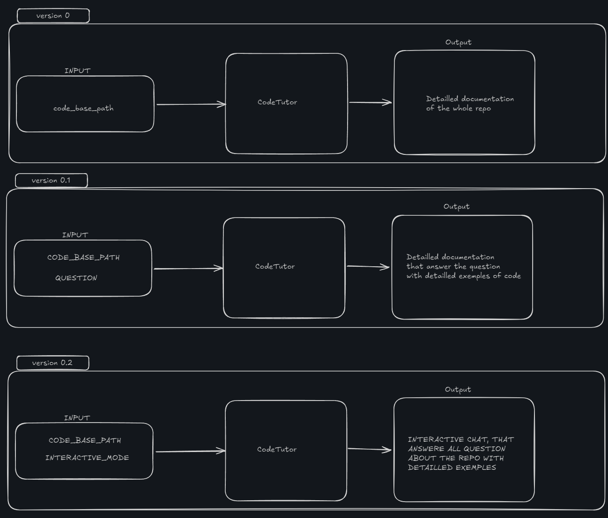

# DocTutor

Welcome to **DocTutor**! This repository is designed to revolutionize how you interact with your codebase by automatically generating comprehensive documentation and detailed examples tailored to your needs. Whether you're looking to document your entire project or focus on specific questions, **DocTutor** has you covered with its intelligent documentation and interactive Command Line Interface (CLI).

## Overview

Keeping documentation current and useful is a persistent challenge in software development. **DocTutor** automates this process, generating thorough and focused documentation for any codebase you provide. The CLI not only generates documentation but also allows you to ask specific questions, ensuring the documentation is relevant and targeted to your immediate needs.

## Key Features

- **Automated Documentation Generation**: Seamlessly create detailed documentation for your codebase, complete with examples on how to use various parts of your project.

- **Interactive CLI**: Ask questions about your codebase and receive documentation focused specifically on those queries, enhancing understanding and usability.

- **Detailed Examples**: Automatically include practical examples in the generated documentation, demonstrating how to effectively use different components of your codebase.

- **Context-Sensitive Output**: Tailor documentation output to address specific questions or areas of interest, ensuring you get the most relevant information.

## Current Goals

## Why DocTutor is Useful

1. **Enhanced Understanding**: By providing both general and question-focused documentation, DocTutor helps developers quickly grasp complex code structures and functionalities.

2. **Time Efficiency**: Automate the documentation process, freeing developers from the repetitive task of manual documentation and allowing them to concentrate on development.

3. **Improved Onboarding**: New team members can quickly access precise and relevant documentation, speeding up the onboarding process and reducing the learning curve.

4. **Facilitates Collaboration**: Comprehensive and targeted documentation improves communication within teams, ensuring everyone has the information they need to contribute effectively.

5. **Higher Code Quality**: Detailed documentation and examples promote best practices and help maintain high coding standards across the project.

## Getting Started

To start using **DocTutor**, clone the repository and follow the instructions in `setup.md` for installation and setup. Once set up, you can begin generating documentation for your codebase and use the CLI to ask questions and receive targeted documentation.

## Contributing

We welcome contributions from the community! If you have ideas for new features, bug fixes, or improvements, please open an issue or submit a pull request.

----

We hope **DocTutor** becomes an essential tool in your development toolkit, simplifying documentation and enhancing your understanding of your codebase. If you have any questions or feedback, please reach out. Happy documenting!
